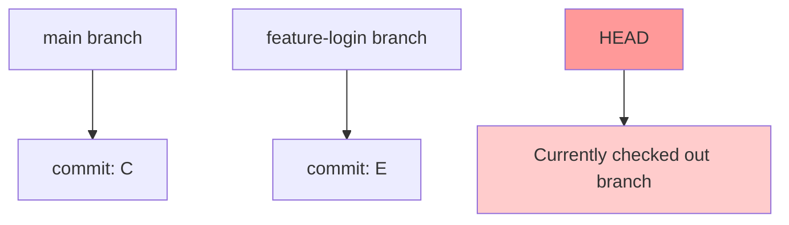
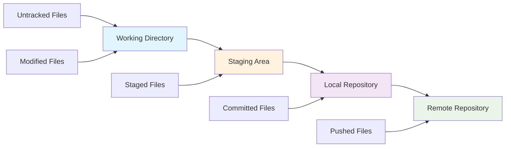
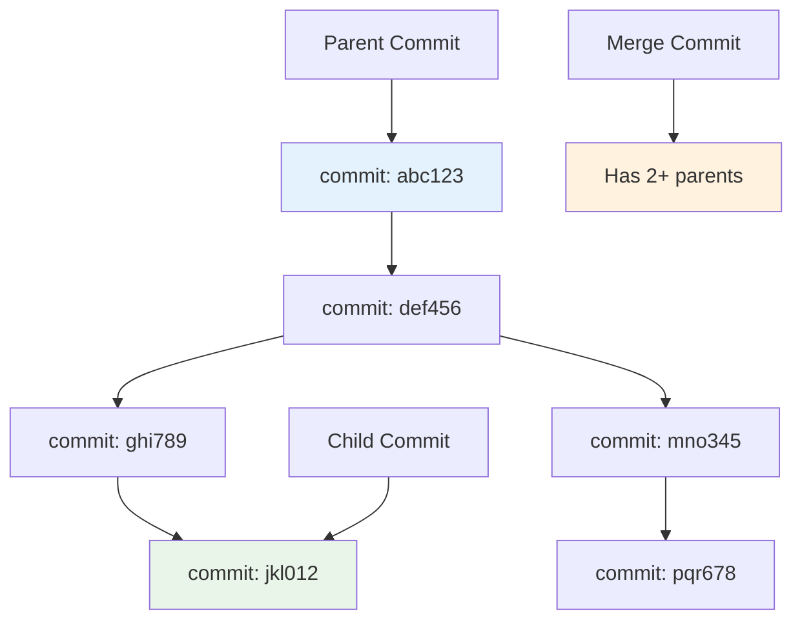
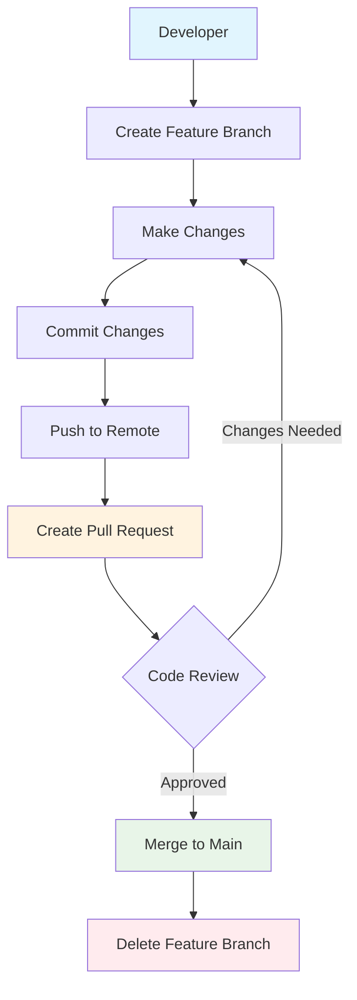
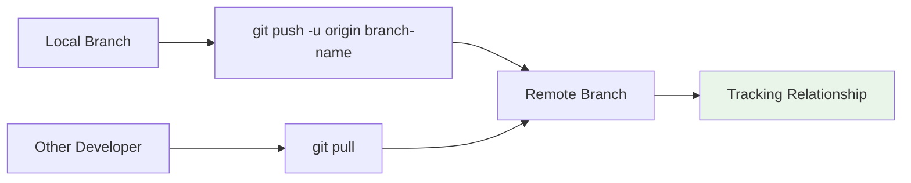

- When you create a branch in Git, you are copying all the code files from the main branch to the newly created branch
  - the main branch can be thought of as the trunk of a tree, where all code was worked on at the start of the repo creation
- You can have as many branches in your codebase as you want

- 🤓 Analogy: Branching in git can be thought of as parallel universes when making choices. Suppose you choose to study this git documentation, then the ideal path would be you completing this documentation. However, if you deviate from this behavior and decide to quit reading this documentation at this exact moment, you are creating a parallel universe in which you did not read the documentation. You can do different things in this parallel universe like meeting with a friend, have fun, etc, but it all started with you reading the documentation. The point where you quit reading the documentation is the point when two different branches were created: the one where you read the documentation, and one where you didn't. Branch 1 can be named as read-documentation / main, and Branch 2 can be named fun-implementation-in-life.

## Examples of real world use cases of creating branches for specific tasks:

- you can have specific environments: dev, test main:
  - this is the practice where you write code in the dev branch, test for bugs in the test branch, and release code that you will use to serve customers in main
- you can have branches to specific devs: prath, basch, ...
  - different people work on files at the same time
- you can have branches for features: redbull-wing-irl-implementation, etc:
  - a good practice is to create a new branch for each feature, and combine (merge) the changes to the main when you are done

## Most Important Git Branch Commands:

```bash
git branch # list all local branches

git branch branch-name # create a new branch under the name branch-name

git checkout branch-name # switch to the branch-name branch

git checkout -b branch-name # creating + switching to a branch branch-name

git branch -d branch-name # delete a branch

git branch -m old-branch-name new-branch-name # rename a branch locally

git branch -a # list all branches locally + REMOTE
```

## Remote Branch Syncing:

- when you create a branch locally and try to push, there is no such branch on remote yet (the branch is only on your local computer, not online)
- you would have to sync your branch to remote:

```
git push -u origin branchname
```

- -u is short for --set-upstream

## Viewing your Git Tree:

- good extension is Git Graph for VSC

i. Download Git Graph for Visual Studio Code
ii. navigate to Source Control on the left strip of the IDE
iii. click on the second last icon, which will say "View Git Graph (git log)" upon hovering
![[Pasted image 20250624152950.png]]

iv. you will see a neatly formatted git commit tree

## Checking out to a Commit instead of a Branch

```bash
git checkout <commit hash>
```

## Finding the Commit Hash:

run `git log`, more details about this command in the next page

## Visual Understanding of Git Branches

### 1. Basic Branch Concept

Think of branches as parallel timelines of your project:

```mermaid
gitgraph
    commit id: "Initial commit"
    commit id: "Add README"
    commit id: "Setup project"
    branch feature-login
    checkout feature-login
    commit id: "Add login form"
    commit id: "Add validation"
    checkout main
    commit id: "Fix typo"
    checkout feature-login
    commit id: "Add styling"
    checkout main
    merge feature-login
    commit id: "Release v1.0"
```

**Key Visual Elements:**

- **Commits**: Each circle represents a commit (snapshot of your code)
- **Branch Line**: Each line represents a different branch
- **Merge**: Where branches come back together
- **HEAD**: Points to your current location (not shown in diagram, but important concept)

### 2. Branch Creation and Switching

```mermaid
gitgraph
    commit id: "A"
    commit id: "B"
    commit id: "C" type: HIGHLIGHT
    branch feature-A
    checkout feature-A
    commit id: "D"
    commit id: "E"
    checkout main
    branch feature-B
    checkout feature-B
    commit id: "F"
    commit id: "G"
```

**What's happening here:**

- We start with commits A, B, C on `main`
- At commit C, we create `feature-A` branch
- We make commits D, E on `feature-A`
- We switch back to `main` and create `feature-B`
- We make commits F, G on `feature-B`

### 3. Understanding HEAD Pointer



**HEAD** is like a bookmark that shows:

- Which branch you're currently on
- Which commit you're looking at
- Where new commits will be added

### 4. Common Branching Workflows

#### Feature Branch Workflow

```mermaid
gitgraph
    commit id: "Initial"
    branch develop
    checkout develop
    commit id: "Setup dev"

    branch feature-auth
    checkout feature-auth
    commit id: "Add login"
    commit id: "Add logout"

    checkout develop
    branch feature-dashboard
    checkout feature-dashboard
    commit id: "Create dashboard"
    commit id: "Add widgets"

    checkout develop
    merge feature-auth
    merge feature-dashboard

    checkout main
    merge develop
    commit id: "Release v1.0"
```

#### Hotfix Workflow

```mermaid
gitgraph
    commit id: "v1.0"
    commit id: "Feature work"
    branch hotfix
    checkout hotfix
    commit id: "Critical fix"
    checkout main
    merge hotfix
    commit id: "v1.0.1"
```

### 5. Branch States and Terminology



### 6. Branch Divergence and Convergence

```mermaid
gitgraph
    commit id: "Start"
    commit id: "Shared work"
    branch alice-work
    branch bob-work

    checkout alice-work
    commit id: "Alice: Feature A"
    commit id: "Alice: Fix bug"

    checkout bob-work
    commit id: "Bob: Feature B"
    commit id: "Bob: Add tests"

    checkout main
    commit id: "Main: Hotfix"

    merge alice-work
    merge bob-work
    commit id: "Combined work"
```

**Important Concepts Visualized:**

- **Divergence**: When branches split apart (different development paths)
- **Convergence**: When branches merge back together
- **Parallel Development**: Multiple people working simultaneously

### 7. Understanding Commit Relationships



**Commit Relationships:**

- **Parent**: The commit that came before
- **Child**: The commit that comes after
- **Merge Commit**: A commit with multiple parents (from merging branches)
- **Commit Hash**: Unique identifier for each commit (like abc123)

### 8. Branch Protection and Flow



## Branch Command Visualization

### Creating and Switching Branches

```bash
# Current state: on main branch
git branch feature-xyz     # Creates new branch (still on main)
git checkout feature-xyz   # Switches to new branch
# OR combine both:
git checkout -b feature-xyz
```

```mermaid
gitgraph
    commit id: "A"
    commit id: "B" type: HIGHLIGHT
    branch feature-xyz
    checkout feature-xyz
    commit id: "C"
    commit id: "D"
```

### Branch Listing and Management

```bash
git branch           # List local branches
git branch -a        # List all branches (local + remote)
git branch -d name   # Delete merged branch
git branch -D name   # Force delete branch
```

### Remote Branch Tracking



## Pro Tips for Branch Visualization

1. **Use Git Graph Extension**: Visual representation in VS Code
2. **Command Line Tools**: `git log --oneline --graph --all`
3. **Think in Timelines**: Each branch is a separate timeline of changes
4. **Understand Pointers**: Branches are just pointers to commits
5. **HEAD Movement**: Track where you are in the commit history
