- When you create a branch in Git, you are copying all the code files from the main branch to the newly created branch
  - the main branch can be thought of as the trunk of a tree, where all code was worked on at the start of the repo creation
- You can have as many branches in your codebase as you want

- 🤓 Analogy: Branching in git can be thought of as parallel universes when making choices. Suppose you choose to study this git documentation, then the ideal path would be you completing this documentation. However, if you deviate from this behavior and decide to quit reading this documentation at this exact moment, you are creating a parallel universe in which you did not read the documentation. You can do different things in this parallel universe like meeting with a friend, have fun, etc, but it all started with you reading the documentation. The point where you quit reading the documentation is the point when two different branches were created: the one where you read the documentation, and one where you didn't. Branch 1 can be named as read-documentation / main, and Branch 2 can be named fun-implementation-in-life.

## Examples of real world use cases of creating branches for specific tasks:

- you can have specific environments: dev, test main:
  - this is the practice where you write code in the dev branch, test for bugs in the test branch, and release code that you will use to serve customers in main
- you can have branches to specific devs: prath, basch, ...
  - different people work on files at the same time
- you can have branches for features: redbull-wing-irl-implementation, etc:
  - a good practice is to create a new branch for each feature, and combine (merge) the changes to the main when you are done

## Most Important Git Branch Commands:

```bash
git branch # list all local branches

git branch branch-name # create a new branch under the name branch-name

git checkout branch-name # switch to the branch-name branch

git checkout -b branch-name # creating + switching to a branch branch-name

git branch -d branch-name # delete a branch

git branch -m old-branch-name new-branch-name # rename a branch locally

git branch -a # list all branches locally + REMOTE
```

## Remote Branch Syncing:

- when you create a branch locally and try to push, there is no such branch on remote yet (the branch is only on your local computer, not online)
- you would have to sync your branch to remote:

```
git push -u origin branchname
```

- -u is short for --set-upstream

## Visual Understanding of Git Branches

### 1. Basic Branch Concept

Think of branches as parallel timelines of your project:


**Key Visual Elements:**

- **Commits**: Each box represents a commit (snapshot of your code)
- **Branch Lines**: Different paths show different branches
- **Merge**: Where branches come back together (H)
- **Branch Point**: Where new branches split off (C)

### 2. Branch Creation and Switching


**What's happening here:**

- Commits A, B, C happen on `main` branch
- At commit C, we create two new branches
- Each branch continues with its own commits
- All branches share the common history up to point C

### 3. Understanding HEAD Pointer


**HEAD** is like a bookmark that shows:

- Which branch you're currently on
- Which commit you're looking at
- Where new commits will be added

### 4. Common Branching Workflows

#### Feature Branch Workflow


#### Hotfix Workflow


### 5. Git Workflow States

```mermaid
graph LR
    A[Working Directory<br/>📁 Your files] --> B[Staging Area<br/>📋 Ready to commit]
    B --> C[Local Repository<br/>💾 Committed]
    C --> D[Remote Repository<br/>☁️ Pushed to GitHub]

    E[Modified files] --> A
    F[git add] --> B
    G[git commit] --> C
    H[git push] --> D

    style A fill:#e3f2fd
    style B fill:#fff3e0
    style C fill:#f3e5f5
    style D fill:#e8f5e8
```



### 6. Parallel Development Scenario


### 7. Understanding Commit Relationships


**Commit Relationships:**

- **Parent**: The commit that came before (abc123 → def456)
- **Child**: The commit that comes after
- **Merge Commit**: A commit with multiple parents (xyz999)
- **Commit Hash**: Unique identifier for each commit

### 8. Branch Protection and Development Flow

```mermaid
graph TD
    A[👨‍💻 Developer] --> B[Create Feature Branch]
    B --> C[Write Code]
    C --> D[git add & git commit]
    D --> E[git push to remote]
    E --> F[Create Pull Request]
    F --> G{Code Review}
    G -->|✅ Approved| H[Merge to Main]
    G -->|❌ Changes Needed| C
    H --> I[🗑️ Delete Feature Branch]
    H --> J[🚀 Deploy to Production]

    style A fill:#e1f5fe
    style F fill:#fff3e0
    style H fill:#e8f5e8
    style I fill:#ffebee
    style J fill:#e8f5e8
```



## Branch Command Visualization

### Creating and Switching Branches

```bash
# Current state: on main branch
git branch feature-xyz     # Creates new branch (still on main)
git checkout feature-xyz   # Switches to new branch
# OR combine both:
git checkout -b feature-xyz
```



```mermaid
graph TD
    A[main branch] --> B[Commit A]
    B --> C[Commit B]
    C --> D[📍 You are here]

    E[After: git checkout -b feature-xyz] --> F[New branch created]
    C --> G[feature-xyz branch]
    G --> H[📍 You are now here]

    style D fill:#2196f3
    style H fill:#ff9800
```

### Remote Branch Tracking


## Advanced Branch Concepts

### 9. Branch Naming Conventions


**Common Naming Patterns:**

- `feature/` - New features
- `bugfix/` - Bug fixes
- `hotfix/` - Critical fixes
- `release/` - Release preparation
- `chore/` - Maintenance tasks

### 10. Branch Lifecycle

```mermaid
graph TD
    A[🌱 Create Branch] --> B[💻 Develop]
    B --> C[🔄 Regular Commits]
    C --> D[📤 Push to Remote]
    D --> E[📋 Create Pull Request]
    E --> F[👀 Code Review]
    F --> G{Review Result}
    G -->|✅| H[🔀 Merge]
    G -->|❌| I[🔧 Address Feedback]
    I --> C
    H --> J[🧹 Cleanup]
    J --> K[🗑️ Delete Branch]

    style A fill:#4caf50
    style H fill:#2196f3
    style K fill:#f44336
```



## Pro Tips for Branch Visualization

1. **Use Git Graph Extension**: Visual representation in VS Code
2. **Command Line Tools**: `git log --oneline --graph --all`
3. **Think in Timelines**: Each branch is a separate timeline of changes
4. **Understand Pointers**: Branches are just pointers to commits
5. **HEAD Movement**: Track where you are in the commit history

### Visualization Commands

```bash
# See branch structure in terminal
git log --oneline --graph --all --decorate

# See all branches
git branch -a

# See branch relationships
git show-branch

# Visual diff between branches
git diff main..feature-branch
```
